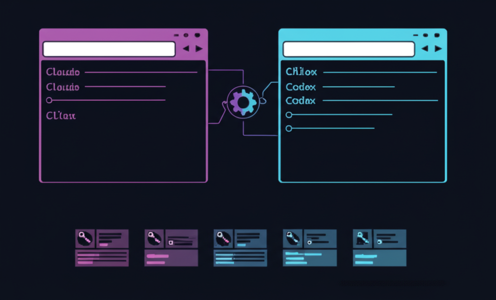

# ccc — Claude Code / Codex Launcher



Manage multiple API profiles for **Claude Code** and **OpenAI Codex**. Switch between providers, keys, and endpoints instantly.

管理 **Claude Code** 和 **OpenAI Codex** 的多套 API 配置，一键切换 Provider、Key 和 Endpoint。

## Install

```bash
npm install -g @tkpdx01/ccc
```

## Quick Start

```bash
ccc new              # Create a profile (Claude or Codex)
ccc list             # List all profiles
ccc <profile>        # Launch with profile (by name or index)
ccc                  # Launch default, or select interactively
```

## Commands

### Launch

```bash
ccc <profile>        # Auto-detect type and launch
ccc <index>          # Launch by index number (e.g. ccc 3)
ccc -d               # Claude: --dangerously-skip-permissions / Codex: --full-auto
```

### Profile Management

```bash
ccc new [name]       # Create profile (choose Claude or Codex)
ccc edit [profile]   # Edit API credentials
ccc use <profile>    # Set default profile
ccc show [profile]   # Show full config
ccc delete [profile] # Delete profile
ccc sync [profile]   # Sync from template, preserve credentials
ccc sync --all       # Sync all profiles
ccc apply [profile]  # Write profile config to ~/.claude or ~/.codex
```

### WebDAV Cloud Sync

```bash
ccc webdav setup     # Configure WebDAV + encryption password
ccc webdav push      # Upload (AES-256-GCM encrypted)
ccc webdav pull      # Download and decrypt
ccc webdav status    # Check sync status
```

## How It Works

### Claude Profiles

Each profile is a copy of `~/.claude/settings.json` with its own API credentials. Launched via:

```
claude --settings ~/.ccc/profiles/<name>.json
```

### Codex Profiles

Each profile is a directory containing `auth.json` + `config.toml`. Launched via:

```
CODEX_HOME=~/.ccc/codex-profiles/<name>/ codex
```

No global environment variables are modified — everything is process-scoped.

### Storage

```
~/.ccc/
├── profiles/              # Claude profiles (*.json)
├── codex-profiles/        # Codex profiles
│   └── <name>/
│       ├── auth.json      # API key
│       └── config.toml    # Model & endpoint config
├── default                # Default profile name
└── webdav.json            # Cloud sync config
```

## Key Features

- **Dual CLI support** — Claude Code + OpenAI Codex in one tool
- **Unified index** — All profiles sorted together, launch by number
- **Apply command** — Push a profile's config to `~/.claude` or `~/.codex`
- **Template sync** — Update from main settings, keep credentials
- **Cloud sync** — E2E encrypted WebDAV sync across devices
- **Zero env pollution** — API keys stored in config files, not shell env

## Security

- **AES-256-GCM** encryption for cloud sync
- **PBKDF2** key derivation (100K iterations)
- **Manual sync only** — no background processes
- **Non-destructive merge** — conflicts preserve both versions

## License

MIT
