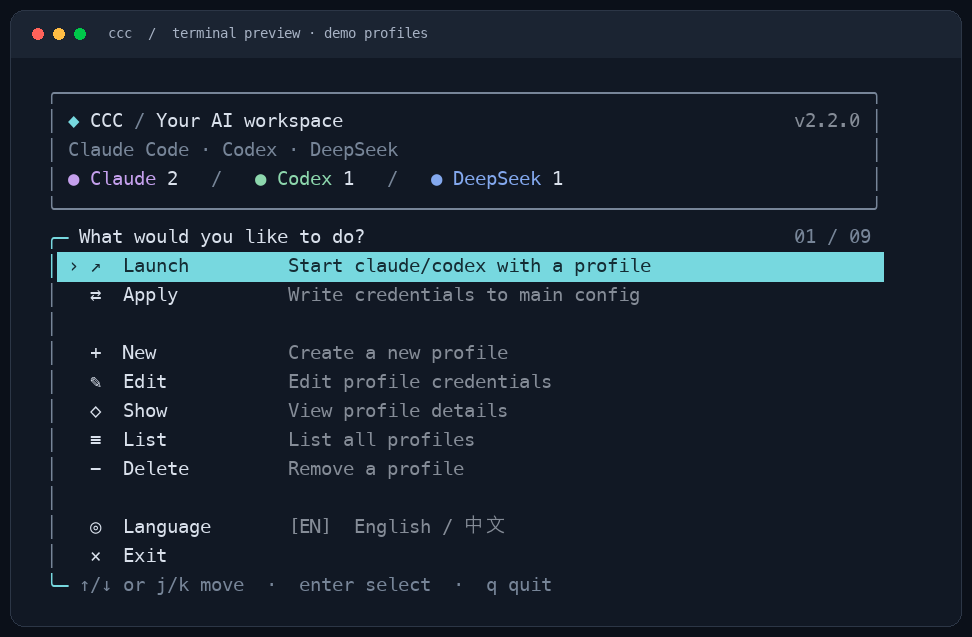

# ccc

> Zero-dependency profile switcher for **Claude Code** & **OpenAI Codex**.



*Terminal preview with demo profiles.*

```bash
npm i -g @tkpdx01/ccc
```

```bash
ccc new          # create a profile
ccc list         # list all
ccc 3            # launch #3
ccc -d           # Claude: --dangerously-skip-permissions; Codex: --dangerously-bypass-approvals-and-sandbox
ccc api -p "Explain this project"  # forward arguments to Claude
ccc api -- --help                # show the child CLI's help
```

The interactive UI includes a workspace header, provider badges, highlighted
menus, and compact layouts for narrow terminals. Use **↑/↓** or **j/k** to
move, **Enter** to select, **Home/End** or **Page Up/Down** for long lists,
and **q** or **Esc** to exit. Chinese text and emoji align by terminal cell
width. Piped output stays free of color codes; `NO_COLOR=1` also disables
colors in interactive terminals.

## How It Works

```
 ~/.ccc/profiles/api.json        ~/.claude/settings.json
      credentials only        +        read-only
              │                           │
              └──── merge at launch ──────┘
                         │
             ~/.ccc/tmp/claude-<id>/api.json
                         │
                claude --settings <tmp>
```

Claude profiles store API URL + key, with optional model, environment, and
settings overrides. At launch, your global `settings.json` is read, merged
with the profile, and passed to `claude` via a private temporary file.
Each launch gets its own file, which is removed when the child exits or
fails to start. Codex uses the profile directory as `CODEX_HOME`.

Normal launches leave global settings unchanged. The explicit `ccc apply`
command writes the selected profile to the global configuration.

Claude launches default to `skipWebFetchPreflight: true`, so WebFetch does
not depend on Anthropic's domain preflight service when using custom or
restricted endpoints. An explicit `false` in the global settings or profile
settings overrides this default.

Existing full `settings.json` profiles and slim profiles remain supported.
Older ccc-generated Codex profiles with model/provider keys inside
`[analytics]` are repaired on launch or when applied. Other tables are kept.
Malformed Claude global settings produce an error so they can be repaired
without losing existing settings.

Extra launch arguments keep their order. Existing ccc flags (`-d`, `--ddd`,
`--help`, and `--version`, including their short aliases) are still handled
by the launcher; use `--` before arguments that should go entirely to the
child CLI.

## Commands

| | |
|---|---|
| `ccc list` | List profiles |
| `ccc new [name]` | Create profile |
| `ccc edit [profile]` | Edit credentials |
| `ccc show [profile]` | Show details |
| `ccc apply [profile]` | Write profile to global config |
| `ccc delete [profile]` | Delete |

## Storage

```
~/.ccc/
├── profiles/          # Claude  { apiUrl, apiKey }
├── codex-profiles/    # Codex   auth.json + config.toml
├── tmp/               # Per-launch merged settings (ephemeral)
└── config.json        # Launcher preferences (language)
```

## License

MIT
